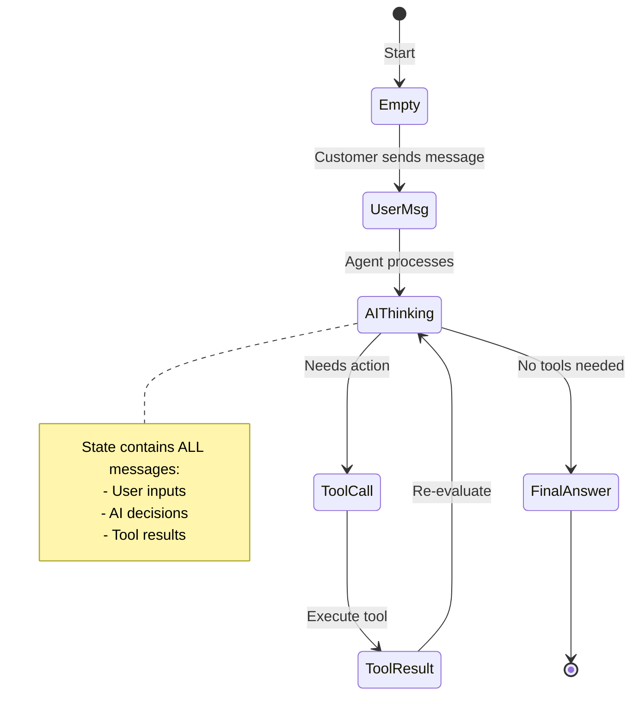
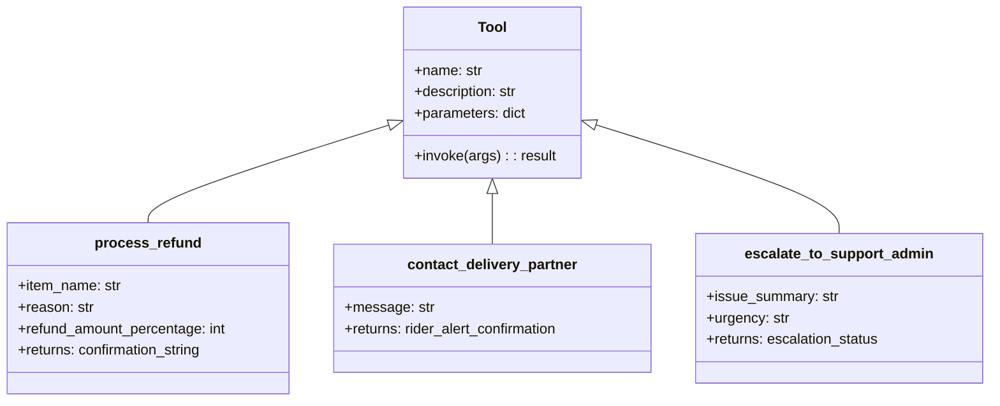
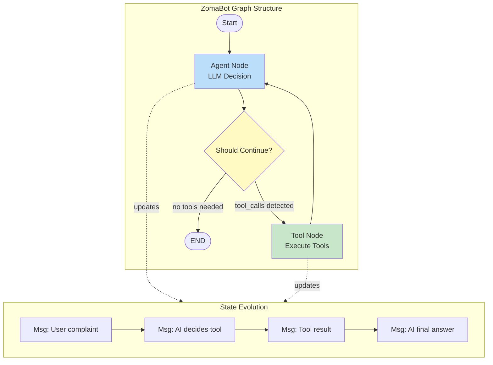
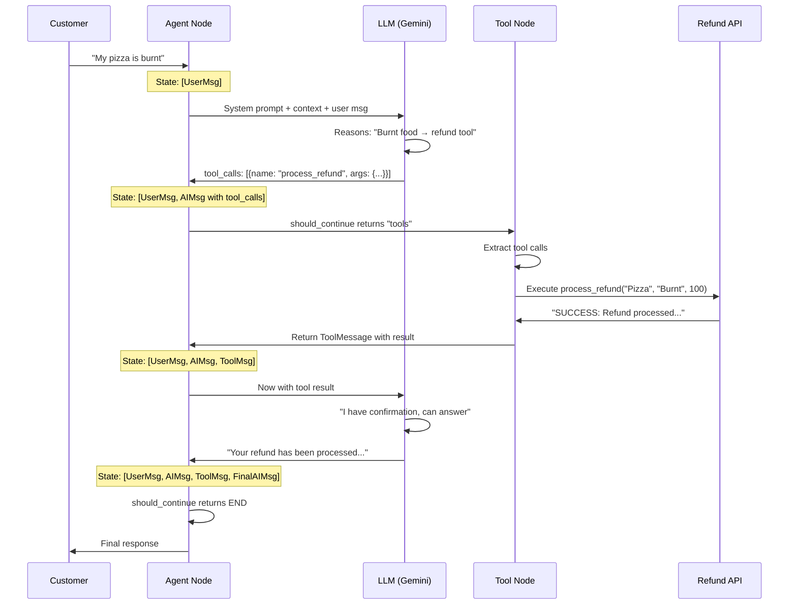
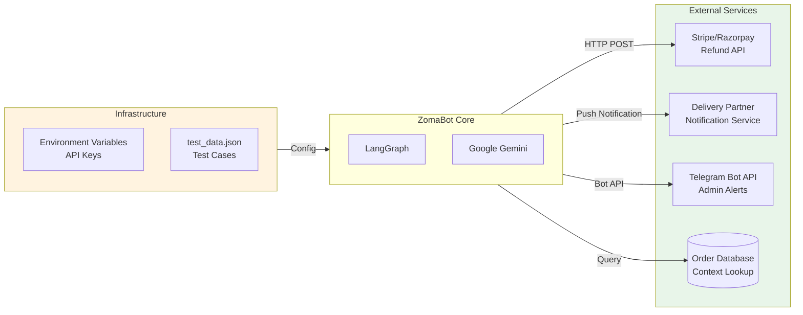

# Building an Agentic AI Application with LangGraph
## Instant Food delivery App Customer Support Automation

---
#### CODE URL : [github.com/bropal404/zomabot](https://github.com/bropal404/zomabot)
---

## 1. Executive Summary

This report documents the development of  an AI-powered customer support agent for food delivery operations. The agent demonstrates core Agentic AI principles: autonomous decision-making, tool utilization, and stateful conversation management using **LangGraph**

---

## 2. Problem Statement & Use Case

### 2.1 Business Context
Food delivery platforms handle thousands of customer complaints daily: refunds for bad food, delivery tracking, technical glitches, and safety concerns. Traditional rule-based chatbots fail because:
- Customer queries are messy and don't fit rigid categories
- Context (order status, items, ETA) must inform decisions
- Some issues require human judgment (escalation)

### 2.2 Agent Requirements
| Capability | Description |
|------------|-------------|
| **Intent Understanding** | Parse natural language complaints |
| **Context Awareness** | Access order details (items, status, ETA) |
| **Tool Selection** | Choose appropriate action from available tools |
| **Conditional Routing** | Escalate severe issues to humans |
| **Stateful Memory** | Remember conversation history |

### 2.3 Agent Architecture Overview

```mermaid
flowchart TB
    subgraph Input["Customer Input Layer"]
        A[Customer Message] --> B[Order Context<br/>Status, Items, ETA]
    end
    
    subgraph AgentCore["ZomaBot Agent Core"]
        C[LangGraph State Machine] --> D[LLM Router<br/>Gemini 2.5 Flash]
        D --> E{Decision Point}
        E -->|Refund Request| F[process_refund]
        E -->|Delivery Issue| G[contact_delivery_partner]
        E -->|Critical Issue| H[escalate_to_support_admin]
        E -->|General Query| I[Direct Response]
    end
    
    subgraph Output["Action Layer"]
        F --> J[Payment System]
        G --> K[Rider App]
        H --> L[Telegram Admin]
        I --> M[Customer Chat]
    end
    
    B --> C
    style AgentCore fill:#e1f5fe
    style Input fill:#f3e5f5
    style Output fill:#e8f5e9
   ```


---

## 3. Core Concepts: The LangGraph Framework

### 3.1 LangGraph

LangGraph provides **stateful graph execution**. Unlike simple chains, it allows:
- **Cyclical workflows**: Agent can loop (think -> act -> observe -> think again)
- **Persistent state**: Conversation history flows through every node
- **Explicit control flow**: You define exactly what happens when

```mermaid
graph LR
    A[Traditional Chain<br/>Linear] --> B[Input]
    B --> C[LLM]
    C --> D[Output]
    
    E[LangGraph<br/>Stateful & Cyclic] --> F[Input]
    F --> G[Agent Node]
    G --> H{Tools Needed?}
    H -->|Yes| I[Tool Node]
    I --> G
    H -->|No| J[End]
    
    style E fill:#fff3e0
    style A fill:#f5f5f5
```

### 3.2 The Three Pillars of Our Agent

| Pillar | Implementation | Purpose |
|--------|---------------|---------|
| **Tools** | Python functions with `@tool` decorator | External capabilities (refunds, alerts) |
| **State** | `AgentState` TypedDict | Memory passing between nodes |
| **Graph** | `StateGraph` with conditional edges | Control flow logic |

---

## 4. Step-by-Step Implementation

### Step 1: State Definition

The state is the **single source of truth** that flows through the graph. In our case, it's the conversation history.

```python
class AgentState(TypedDict):
    messages: Annotated[Sequence[BaseMessage], operator.add]
```

**Key insight**: The `Annotated[Sequence[BaseMessage], operator.add]` tells LangGraph to *append* new messages rather than replace them. This creates growing context.



### Step 2: Tool Definition

Tools are Python functions that the LLM can invoke. The `@tool` decorator extracts the function signature and docstring for the LLM's tool-selection logic.

**Our Three Tools:**



**Critical Design Principle**: The docstring *is* the API contract. The LLM reads it to decide when to use the tool:

```python
@tool
def process_refund(item_name: str, reason: str, refund_amount_percentage: int = 100):
    """
    Issue a refund for a specific item.
    Args:
        item_name: The name of the item (e.g., "Chicken Pizza").
        reason: Why the refund is needed (e.g., "Burnt", "Missing").
        refund_amount_percentage: 100 for full refund, 50 for partial.
    """
```

### Step 3: Graph Construction

This is where we wire everything together. The graph defines **nodes** (actions) and **edges** (transitions).



**Implementation:**

```python
# Create graph with our state type
workflow = StateGraph(AgentState)

# Add nodes
workflow.add_node("agent", agent_node)     
workflow.add_node("tools", tool_node)       # Tools execute

workflow.set_entry_point("agent")
workflow.add_conditional_edges(
    "agent",
    should_continue,                          # Router function
    {"tools": "tools", END: END}             # Mapping: return value -> next node
)
workflow.add_edge("tools", "agent")

# Compile to runnable application
agent_app = workflow.compile()
```

### Step 4: The Decision Router

The `should_continue` function is the **control logic**:

```python
def should_continue(state: AgentState):
    last_message = state["messages"][-1]
    if last_message.tool_calls:      # LLM requested tool execution
        return "tools"
    return END                        # LLM provided final answer
```

This creates the **agent loop**: the LLM can call tools, observe results, and decide to call more tools or respond.

---

## 5. Execution Flow: How ZomaBot Thinks

Let's trace a real example: *"My pizza is burnt, I want a refund"*



---

## 6. Integration with External Services

Real-world agents connect to existing infrastructure:



**API Integration Pattern:**

```python
@tool
def escalate_to_support_admin(issue_summary: str, urgency: str):
    """Escalate to human admin via Telegram"""
    token = os.getenv("TELEGRAM_BOT_TOKEN")      # Secure credential
    chat_id = os.getenv("TELEGRAM_CHAT_ID")
    
    # Real HTTP call to external service
    requests.post(
        f"https://api.telegram.org/bot{token}/sendMessage",
        data={"chat_id": chat_id, "text": alert_text}
    )
```

---

## 7. Testing & Evaluation

The `test_data.json` provides structured test cases:

```json
{
  "id": 1,
  "user_input": "My chicken pizza was completely burnt",
  "context": {
    "status": "Delivered",
    "items": ["Chicken Pizza", "Coke"],
    "eta": "19:30",
    "time_placed": "19:00"
  },
  "expected_action": "process_refund"
}
```


## 8. Key Architectural Decisions

| Decision | Rationale |
|----------|-----------|
| **LangGraph over simple chains** | Need for cyclical tool-use loops |
| **TypedDict state** | Type safety + clear data contract |
| **Tool factory pattern** | Dependency injection (db sessions, API clients) |
| **Temperature=0** | Deterministic tool selection for reliability |
| **Recursion limit** | Safety against infinite loops |
| **Environment variables** | Secure credential management |

---

## 9. Conclusion

This implementation demonstrates that **Agentic AI** is 

1. **Clear state management** separates memory from logic
2. **Explicit graph construction** makes control flow visible and debuggable
3. **Tool abstraction** allows LLM to interact with real systems safely
4. **Conditional routing** enables autonomous decision-making

The LangGraph approach transforms LLMs from passive text generators into **active agents** that can perceive (read state), decide (route logic), and act (call tools)

---
